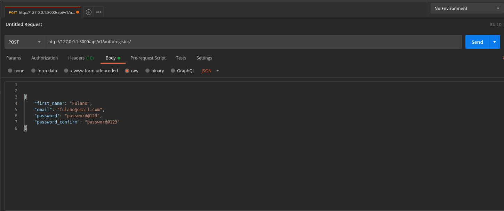

# medicar

System for managing appointments in a medical clinic


[](https://codecov.io/gh/alisonamerico/medicar)
[](https://pyup.io/repos/github/alisonamerico/medicar/)
[](https://pyup.io/repos/github/alisonamerico/medicar/)

Processes used in project development:

Continuous Delivery:

- Integration with Poetry, Github Actions(CI/CD) and Pyup

- Automatic Deploy for Heroku

- Pytest: To set up and build automated tests for Django.

- Codecov: For Test Coverage

- python-decouple: To decouple application instance settings.

- Docker: Run applications by using containers.

Dependencies used in the project:

```toml
[tool.poetry]
name = "medicar"
version = "0.1.0"
description = "System for managing appointments in a medical clinic"
authors = ["alisonamerico <alison.americo@gmail.com>"]

[tool.poetry.dependencies]
python = "^3.8"
django = "^3.1.1"
gunicorn = "^20.0.4"
python-decouple = "^3.3"
dj-database-url = "^0.5.0"
psycopg2-binary = "^2.8.6"
djangorestframework = "^3.11.1"
django-cors-headers = "^3.5.0"
django-phone-field = "^1.8.1"
dj-static = "^0.0.6"
django-rest-registration = "^0.5.6"
django-filter = "^2.3.0"

[tool.poetry.dev-dependencies]
flake8 = "^3.8.3"
autopep8 = "^1.5.4"
pytest-django = "^3.10.0"
pytest-cov = "^2.10.1"
codecov = "^2.1.9"

[build-system]
requires = ["poetry>=0.12"]
build-backend = "poetry.masonry.api"
```

## Prerequisite Installed:

- Docker
- Docker Compose

For Linux(Ubuntu):
https://docs.docker.com/install/linux/docker-ce/ubuntu/#install-docker-engine---community-1

For Mac:
https://docs.docker.com/docker-for-mac/install/

For Windows:
https://docs.docker.com/docker-for-windows/install/

## How to execute:

```console
git clone https://github.com/alisonamerico/medicar.git
cd medicar
cp contrib/env-sample .env
```

Open two terminals:

```console
1º terminal
docker-compose build
docker-compose up or docker-compose up -d
```

```console
2º terminal
docker-compose exec web python manage.py makemigrations

docker-compose exec web python manage.py migrate
```

Create SuperUser:

```console
docker-compose run web python manage.py createsuperuser
```

Inform:

```console
 - email
 - password
```

How to register user (Postman):

```console
http://127.0.0.1:8000/api/v1/auth/register/

Method HTTP: POST

{
    "first_name": "Fulano",
    "email": "fulano@email.com",
    "password": "password@123",
    "password_confirm": "password@123"
}
```

### Postman:



Created User:


Login and generate a token:
Obs.: Use the 'email' in the 'login' field like the image.

```console
http://127.0.0.1:8000/api/v1/auth/login/

Method HTTP: POST

{
    "login": "fulano@email.com",
    "password": "password@123"
}
```


### Admin:

```console
endpoint: http://0.0.0.0:8000/admin/
```


Admin (Specialties):


```console
Method HTTP: GET

endpoint: http://127.0.0.1:8000/api/v1/specialties/
```

Postman (Specilties JSON):

```json
{
  "count": 4,
  "next": null,
  "previous": null,
  "results": [
    {
      "id": 1,
      "name": "Cardiologia"
    },
    {
      "id": 2,
      "name": "Pediatria"
    },
    {
      "id": 3,
      "name": "Clínico Geral"
    },
    {
      "id": 4,
      "name": "Ginecologia"
    }
  ]
}
```

Admin (Doctors):


Admin (Doctor Detail):


```console
Method HTTP: GET

endpoint: http://127.0.0.1:8000/api/v1/doctors/
```

Postman (Doctors JSON):

```json
{
  "count": 3,
  "next": null,
  "previous": null,
  "results": [
    {
      "id": 1,
      "crm": 2544,
      "name": "Gregory House",
      "specialty": {
        "id": 1,
        "name": "Cardiologia"
      }
    },
    {
      "id": 2,
      "crm": 3711,
      "name": "Drauzio Varella",
      "specialty": {
        "id": 3,
        "name": "Clínico Geral"
      }
    },
    {
      "id": 3,
      "crm": 3087,
      "name": "Tony Tony Chopper",
      "specialty": {
        "id": 2,
        "name": "Pediatria"
      }
    }
  ]
}
```

Admin (Schedules):


Admin (Schedule Detail):


```console
Method HTTP: GET

endpoint: http://127.0.0.1:8000/api/v1/schedules/
```

Postman (Schedules JSON):

```json
{
  "count": 3,
  "next": null,
  "previous": null,
  "results": [
    {
      "id": 3,
      "doctor": {
        "id": 3,
        "crm": 3087,
        "name": "Tony Tony Chopper",
        "specialty": {
          "id": 2,
          "name": "Pediatria"
        }
      },
      "day": "2020-09-25",
      "hourlys": ["10:00:00", "10:30:00", "14:30:00", "15:00:00"]
    },
    {
      "id": 2,
      "doctor": {
        "id": 2,
        "crm": 3711,
        "name": "Drauzio Varella",
        "specialty": {
          "id": 3,
          "name": "Clínico Geral"
        }
      },
      "day": "2020-09-24",
      "hourlys": ["08:00:00", "08:30:00", "09:30:00"]
    },
    {
      "id": 1,
      "doctor": {
        "id": 1,
        "crm": 2544,
        "name": "Gregory House",
        "specialty": {
          "id": 1,
          "name": "Cardiologia"
        }
      },
      "day": "2020-09-23",
      "hourlys": ["14:00:00"]
    }
  ]
}
```

Create Medical Appointment :


```console
endpoint: http://127.0.0.1:8000/api/v1/appointments/

Method HTTP: POST

{
    "schedule_id": 3,
    "hourly": "10:00:00"
}
```

Return:

```json
{
  "id": 4,
  "day": "2020-09-25",
  "hourly": "10:00:00",
  "scheduling_date": "2020-09-24T00:18:03.459111-03:00",
  "doctor": {
    "id": 3,
    "crm": 3087,
    "name": "Tony Tony Chopper",
    "specialty": {
      "id": 2,
      "name": "Pediatria"
    }
  }
}
```

Return Admin Medical Appointment:


When you’re done, don’t forget to close down your Docker container! :wink:

```console
docker-compose down
```
